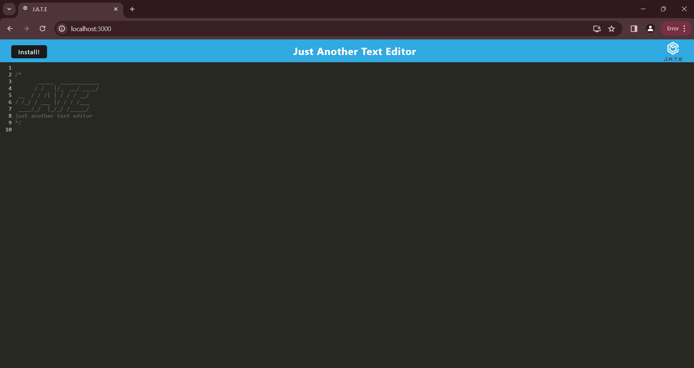
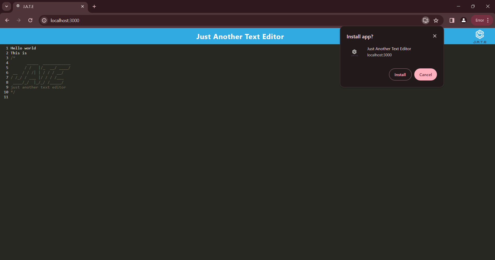

# 📝 Just Another Text Editor (JATE) 🖋️

|  |  |
|:------------------------------------------:|:------------------------------------------:|

Just Another Text Editor (JATE) is a sleek and minimalist web application that allows you to create and save notes or code snippets effortlessly. Whether you're a developer jotting down ideas or a student taking notes during lectures, JATE is your go-to tool for reliable content creation, with or without an internet connection.

## Table of Contents

- [Features](#-features)
- [Getting Started](#-getting-started)
- [Deployment](#deployment)
- [License](#license)
- [Contributing](#contributing)
- [Demo Video](#demo)
- [GitHub](#github)

## ✨ Features

- **Offline Capability:** Create and access your notes anytime, anywhere, even without an internet connection, thanks to IndexedDB storage.
- **Syntax Highlighting:** Enjoy syntax highlighting for JavaScript code snippets, enhancing readability and clarity.
- **Service Worker:** JATE comes with a registered service worker using Workbox, ensuring a seamless offline experience and fast loading times.
- **Installable:** Install JATE as a progressive web app (PWA) for quick access from your desktop or mobile device, just like a native application.

## 🚀 Getting Started

To get started with JATE, follow these simple steps:

1. Clone the repository: `git clone https://github.com/Philip-Tom/Just-Another-Text-Editor-JATE-.git`
2. Navigate to the project directory: `cd Just-Another-Text-Editor-JATE-`
3. Install dependencies for both client and server: `npm run install`
4. Start the application: `npm run start`

That's it! You're ready to start creating and saving your notes with JATE.

## Deployment

JATE is deployed and accessible online. You can try it out right now by visiting [JATE Demo](https://just-another-text-editor-jate-1.onrender.com/).

## License

This project is licensed under the MIT License - see the [LICENSE.md](LICENSE.md) file for details.

## Contributing

Contributions are welcome! Feel free to submit bug reports, feature requests, or pull requests to help improve JATE and make it even better for the community.

## Demo

https://github.com/Philip-Tom/Just-Another-Text-Editor-JATE-/assets/147503829/59900b3f-9b77-4401-93e4-bd42e9b848d3

## GitHub

Explore the source code and contribute to JATE on [GitHub](https://github.com/Philip-Tom/Just-Another-Text-Editor-JATE-).
Happy note-taking with JATE! 🎉
